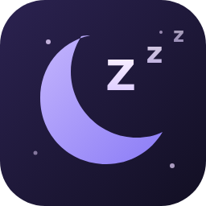

#  SnoreClient

[](https://github.com/aababababababbabaabababababba/SnoreClient/actions/workflows/test.yml)
[](https://github.com/aababababababbabaabababababba/SnoreClient/actions/workflows/build.yml)

## About this project

I was bored and had an idea to make a Discord client. I do not claim any of the work that Claude AI did for me. I did none of the work besides putting the stuff together and debugging issues.

**Discord, but cozier.** SnoreClient is a Discord client mod forked from [Equicord](https://github.com/Equicord/Equicord) (itself a fork of [Vencord](https://github.com/Vendicated/Vencord)). It keeps the full plugin collection and adds:

- **Its own cloud.** Settings, QuickCSS and plugin data sync between devices through the SnoreClient cloud at snore.pw.
- **A fresh look.** New logo, a redesigned settings landing panel, polished cards, and a matching web front end served by the same server.

## Install

**Launcher (recommended):** [SnoreClientLauncher.exe](https://github.com/aababababababbabaabababababba/SnoreClient/releases/latest/download/SnoreClientLauncher.exe) for Windows ([ARM64](https://github.com/aababababababbabaabababababba/SnoreClient/releases/latest/download/SnoreClientLauncher-arm64.exe)), [Linux](https://github.com/aababababababbabaabababababba/SnoreClient/releases/latest/download/SnoreClientLauncher-linux) ([ARM64](https://github.com/aababababababbabaabababababba/SnoreClient/releases/latest/download/SnoreClientLauncher-linux-arm64)). One window: it shows whether SnoreClient is installed and current, updates it when needed, and starts Discord with SnoreClient in one click. The full installer is one button away inside it.

| Platform | Download |
| --- | --- |
| **Windows** | [SnoreClientInstaller.exe](https://github.com/aababababababbabaabababababba/SnoreClient/releases/latest/download/SnoreClientInstaller.exe) · [ARM64](https://github.com/aababababababbabaabababababba/SnoreClient/releases/latest/download/SnoreClientInstaller-arm64.exe) · CLI: [x64](https://github.com/aababababababbabaabababababba/SnoreClient/releases/latest/download/SnoreClientInstallerCli.exe) [ARM64](https://github.com/aababababababbabaabababababba/SnoreClient/releases/latest/download/SnoreClientInstallerCli-arm64.exe) |
| **Linux** | [SnoreClientInstaller-linux](https://github.com/aababababababbabaabababababba/SnoreClient/releases/latest/download/SnoreClientInstaller-linux) (X11 + Wayland) · [ARM64](https://github.com/aababababababbabaabababababba/SnoreClient/releases/latest/download/SnoreClientInstaller-linux-arm64) · CLI: [x64](https://github.com/aababababababbabaabababababba/SnoreClient/releases/latest/download/SnoreClientInstallerCli-linux) [ARM64](https://github.com/aababababababbabaabababababba/SnoreClient/releases/latest/download/SnoreClientInstallerCli-linux-arm64) |
| **macOS** | CLI: [Universal](https://github.com/aababababababbabaabababababba/SnoreClient/releases/latest/download/SnoreClientInstallerCli-universal) · [Apple Silicon](https://github.com/aababababababbabaabababababba/SnoreClient/releases/latest/download/SnoreClientInstallerCli-arm64) · [Intel](https://github.com/aababababababbabaabababababba/SnoreClient/releases/latest/download/SnoreClientInstallerCli-x64) |

The installer is SnoreClient's own build of the Equilotl installer: it downloads the latest SnoreClient from the GitHub release and patches the Discord install you pick. Windows SmartScreen may warn because the file is not code signed; choose "More info → Run anyway". CLI builds on Linux and macOS need `chmod +x` first.

One-liners that fetch and run the installer for you:

```powershell
# Windows (PowerShell)
irm https://github.com/aababababababbabaabababababba/SnoreClient/releases/latest/download/install.ps1 | iex
```

```shell
# Linux / macOS
bash -c "$(curl -fsSL https://github.com/aababababababbabaabababababba/SnoreClient/releases/latest/download/install.sh)"
```

After installing, fully quit Discord (tray icon too) and start it again. Updates arrive through **Settings → SnoreClient → Updater**.

**iPhone / iPad:** [SnoreClient.ipa](https://github.com/aababababababbabaabababababba/SnoreClient/releases/latest/download/SnoreClient.ipa), unsigned. Install with TrollStore as is, or with AltStore, Sideloadly or ESign, which sign it with your own Apple ID. It wraps Discord's web app with SnoreClient injected; see [`ios/README.md`](./ios/README.md) for what works and what doesn't.

**Browser:** download `extension-chrome.zip` or `extension-firefox.zip` from the [latest release](https://github.com/aababababababbabaabababababba/SnoreClient/releases/latest) and load it as an unpacked extension, or install `SnoreClient.user.js` in a userscript manager.

## Source

SnoreClient's own additions are not open for reuse: the cloud backend, installer, and SnoreClient plugins are provided for SnoreClient users only, and there are no self hosting instructions. The repository stays visible because the Vencord and Equicord code it is built on is GPL-3.0 licensed, and that licence requires the source to remain available alongside the builds. If you want SnoreClient, use the installers above and the official snore.pw cloud.

## Credits

SnoreClient stands on the shoulders of [Vencord](https://github.com/Vendicated/Vencord) by [Vendicated](https://github.com/Vendicated) and [Equicord](https://github.com/Equicord/Equicord) by thororen and contributors. Both projects are GPL-3.0 licensed, as is this one. Upstream file headers are kept intact on purpose.

## Disclaimer

Discord is a trademark of Discord Inc. and is mentioned only for descriptive purposes. This project is not affiliated with or endorsed by Discord Inc.

<details>
<summary>Using SnoreClient violates Discord's terms of service</summary>

Client modifications are against Discord's Terms of Service. Discord has historically been indifferent about them and there are no known cases of users being banned simply for using a client mod, but if your account is essential to you, consider not using any client mod. Avoid plugins that implement abusive behaviour, and do not post screenshots that show the mod in servers where that could get you banned.

</details>
